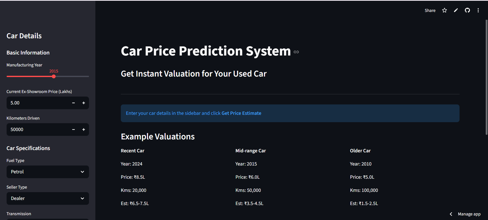

# 🚗 Car Price Predictor

A Machine Learning web application that predicts the price of a used car based on various features such as company, model, year, fuel type, and kilometers driven.

Built using **Python, Machine Learning, Flask/Streamlit, Pandas, NumPy, and Scikit-learn**.

---

## 🔗 Live Demo

👉 https://carpricepredictoriya01.streamlit.app/

---

## 📂 GitHub Repository

👉 https://github.com/Riya6567/CarPrice_Predictor

---

# 📌 Features

* Predicts used car prices instantly
* User-friendly web interface
* Machine Learning model trained on real car dataset
* Responsive and interactive UI
* Real-time prediction system

---

# 🛠️ Tech Stack

## Frontend
* Streamlit UI

## Backend
* Python

## Machine Learning
* Pandas
* NumPy
* Scikit-learn

---

# 📊 Machine Learning Workflow

1. Data Collection
2. Data Cleaning
3. Exploratory Data Analysis (EDA)
4. Feature Engineering
5. Model Training
6. Model Evaluation
7. Deployment using Streamlit

---

# 🚀 Installation & Setup

## Clone the Repository

```bash
git clone https://github.com/Riya6567/CarPrice_Predictor.git
```

## Navigate to Project Folder

```bash
cd CarPrice_Predictor
```

## Install Dependencies

```bash
pip install -r requirements.txt
```

## Run the Application

```bash
streamlit run app.py
```

---

# 📷 Project Preview



---

# 📈 Model Used

* Linear Regression
* Lasso Regressor
* Random Forest Regressor

(Use only the models you actually implemented.)

---

# 🎯 Future Improvements

* Add more advanced ML models
* Improve prediction accuracy
* Add dark mode UI
* Deploy using Docker & Cloud Services
* Add car image recognition

---

# 👩‍💻 Author

## Riya Dey

BCA 4th Year Student | Aspiring Python Developer & ML Enthusiast

* GitHub: https://github.com/Riya6567
* LinkedIn: https://linkedin.com/in/riya-dey-9a3556358

---

# ⭐ Support
If you like this project, please give it a ⭐ on GitHub!
